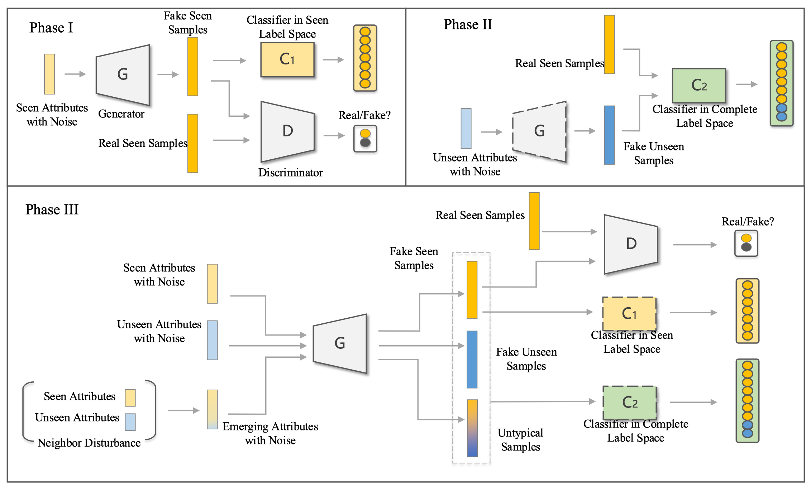

# UFG

This repository contains the reference code for the paper "**Unbiased Feature Generating for Zero-Shot Learning**".




## Dataset

Datasets can be download from [Xian et al. (CVPR2017)](https://datasets.d2.mpi-inf.mpg.de/xian/xlsa17.zip) .

## Requirements

The code implementation of **UFG** mainly based on [PyTorch](https://pytorch.org/).

## Runing

Please run the following commands and testing **UFG** on different datasets: 

```
./ufg-script/gzsl_awa.sh      #AWA
./ufg-script/gzsl_cub.sh      #CUB
./ufg-script/gzsl_sun.sh      #SUN
./ufg-script/gzsl_apy.sh      #APY
```


## Citation

If this work is helpful for you, please cite our paper.

```
@article{niu2022unbiased,
  title={Unbiased feature generating for generalized zero-shot learning},
  author={Niu, Chang and Shang, Junyuan and Huang, Junchu and Yang, Junmei and Song, Yuting and Zhou, Zhiheng and Zhou, Guoxu},
  journal={Journal of Visual Communication and Image Representation},
  pages={103657},
  year={2022},
  publisher={Elsevier}
}
```